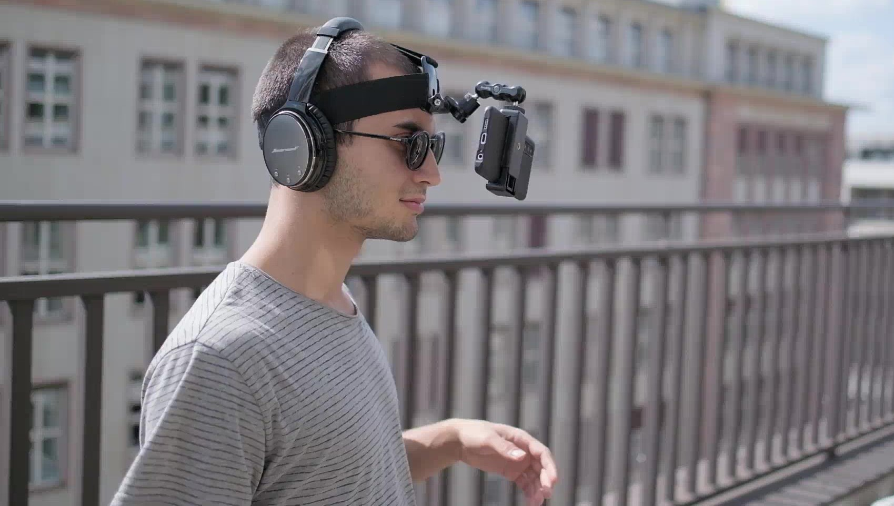
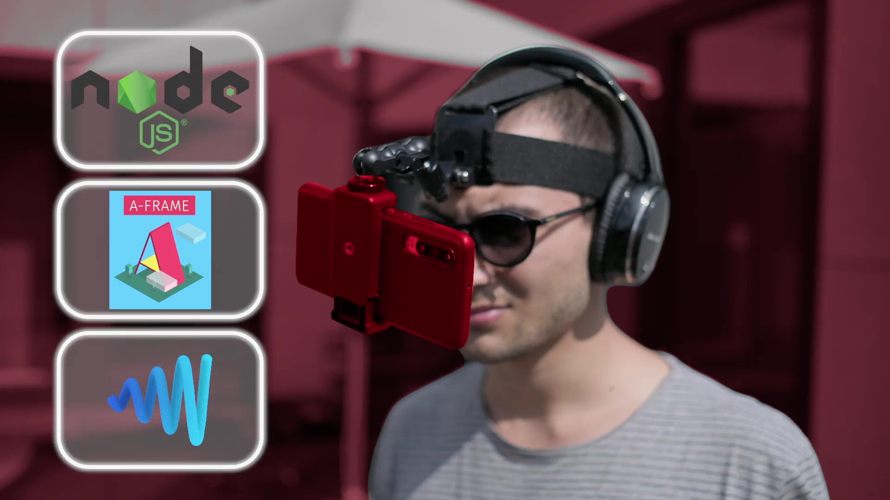
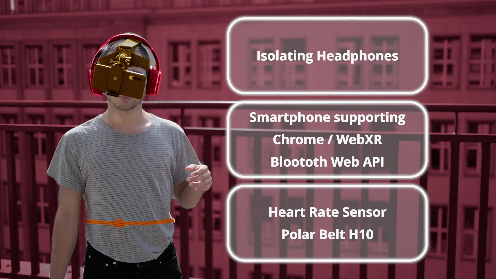

# AR Game: ICU Simulation

**A stress-inducing AR game using 3D spatial audio and heart rate monitoring to evaluate player stress response.**

Built with Node.js, A-Frame, and Resonance Audio.

## Project Overview

Developed as part of the module "Introduction to Physiological Computing" at TU Berlin's Quality and Usability Lab, accompanied by the seminar "Affective Computing" on affect detection using biosignals.

The COVID-19 pandemic highlighted the special strain healthcare workers are put under. This project aimed to further understanding and awareness of that problem by exploring the emotional reaction, stress levels, and performance of non-professionals when exposed to isolated aspects of ICU work: stress through environmental and occupational sound and increasing exigencies. We measured emotions and cognitive performance via heart rate data and game metrics while the user was put under increasing stress in a mobile, cross-platform AR simulation.

## Team

Orhun Caglidil, Damian Dominik Martinez, Janine Güldner (TU Berlin)
This project was made within the "Introduction to Physiological Computing" course, accompanied by the Affective Computing seminar by  Dr.-Ing. Jan-Niklas Voigt-Antons, Quality and Usability Lab, TU Berlin

## Demo

[▶️ Watch the demo on Vimeo](https://vimeo.com/689656425) *(put on headphones to hear the 3D spatial audio)*

## Technical Stack

**Node.js + A-Frame:** The game runs as a web application using A-Frame, an open-source web framework for building VR/AR experiences. The mobile phone's inbuilt sensors were additionally used to control the simulation.

**Resonance Audio (Google):** 3D spatial sounds create a realistic, localized audio environment. The player must localize the source of sounds to find patients that need treatment.

**Polar H10 (Web Bluetooth):** Heart rate sensor connects via Web Bluetooth to monitor stress levels throughout gameplay.

## Experimental Design

Before the simulation started, the participant was introduced with a tutorial that calmed down and prepared them for the scene. Once the simulation began, an increasing number of "patient events" manipulated participants' stress levels over the course of the game. Each patient had different audio stimuli and an irregular treatment duration. Participants depended on 3D spatial sounds to orient themselves in the scene and find the patient that needed treatment. Heart rate data from the Polar Belt was saved after each event.

## Findings

The experiment was accompanied by surveys to verify the physiological data. Survey results showed that participants' awareness of healthcare worker stress levels increased significantly. The increasing number of patient events induced a measurable rise in heart rate, predominantly a sign of elevated stress. Participants could localize the 3D spatial sounds with high accuracy, making such sounds highly suitable for AR/VR applications. The experiment also established that even when relying mostly on audio stimuli with minimal visual input, high stress levels can be generated.

## Setup

